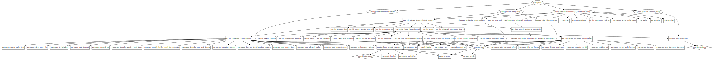

# Aurora (for MySQL) RDS

# Fully automate RDS Creation for prod and staging env

#### Suggestion

- If your project use multiple databases, each database better have its own repo
- For example, if you have one database named `db1`, and another database named `db2`, no matter `db1` and `db2` using same type or RDS or not, each of them should have a separated repo that terraform can run separately

### Purpose:

| Service | Purpose                                                 |
| ------- | ------------------------------------------------------- |
| _RDS_   | stuff for Application manage. This is in Private Subnet |

#### Provision Infra:

    # Note: Before Apply, Please make sure you have made desired changes in your `terraform.tfvars` file

Run these commands to make RDS Instance, `aws_iam_role`, `RDS Cluster`, RDS Cluster Instance, Cluster Parameter Group, DB Parameter Group, Security Group, DB Subnet Group.

```sh
$ cd rds
$ terraform init -backend-config=bucket={Remote_steate_bucketname} -backend-config=key=client/environment/client-service/terraform.tfvars -backend-config=region={aws_region} -backend-config=profile={aws_profile} -backend-config=dynamodb_table={remote_state_dynamoDB_Table} --force-copy
$ terraform plan --var-file=client/environment/terraform.tfvars
$ terraform apply --var-file=client/environment/terraform.tfvars
```

## Infra Graph


